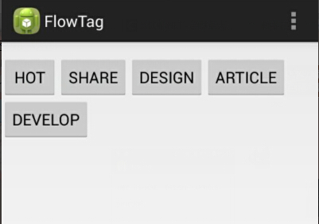

# FlowTagsLayout

Flow Tags

##Preview



##Usage

Use it as ListView

###XML Example

```xml
<!--flow tags layout-->
<RelativeLayout xmlns:android="http://schemas.android.com/apk/res/android"
    xmlns:tools="http://schemas.android.com/tools"
    android:layout_width="match_parent"
    android:layout_height="match_parent"
    android:paddingBottom="@dimen/activity_vertical_margin"
    android:paddingTop="@dimen/activity_vertical_margin"
    tools:context="com.jianbin.flowtag.MainActivity" >

    <com.jianbin.view.FlowTagsLayout
        android:id="@+id/fl_tags"
        android:layout_width="match_parent"
        android:layout_height="wrap_content"
        android:clickable="true" />

</RelativeLayout>
```

```xml
<!--tag item-->
<RelativeLayout xmlns:android="http://schemas.android.com/apk/res/android"
    android:layout_width="wrap_content"
    android:layout_height="wrap_content" >

    <Button
        android:id="@+id/btn_tags_item_text"
        android:layout_width="wrap_content"
        android:layout_height="wrap_content" />

</RelativeLayout>
```

**NOTE:** of course you can use your custom view.

###Java Example

```java
//Initialization
mAdapter = new ArrayAdapter<String>(this, R.layout.tags_item,
				R.id.btn_tags_item_text, new String[]{"TAG1","TAG2","TAG2","TAG3"});
mFlowTagsLayout.setAdapter(mAdapter);
```
**NOTE:** of course you can use your custom adapter, but only array adapter now.

```java
//Add new tag
mAdapter.add("TAG4");
```

```java
//set item click listener
mFlowTagsLayout.setOnItemClickListener(new OnItemClickListener() {

			@Override
			public void onItemClick(AdapterView<?> parent, View view,
					int position, long id) {
				Toast.makeText(MainActivity.this,
						"you click tag " + mAdapter.getItem(position),
						Toast.LENGTH_SHORT).show();
			}

		});
```

```java
//set item long click listener
mFlowTagsLayout.setOnItemLongClickListener(new OnItemLongClickListener() {

					@Override
					public boolean onItemLongClick(AdapterView<?> parent,
							View view, int position, long id) {
						Toast.makeText(MainActivity.this,
								"long click tag " + mAdapter.getItem(position),
								Toast.LENGTH_SHORT).show();
						return true;
					}

				});
```